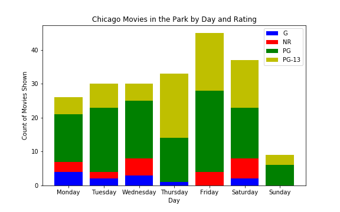

# Pandas Warmup

Pandas out yer ears

Run the cell below w/o changes to load tests


```python

#run without changes

from test_background import pkl_dump, test_obj_dict, run_test_dict, run_test
```

## Data setup

Import: 

- Pandas under the alias 'pd'

- Matplotlib.pyplot under the alias 'plt'

Run:
- %matplotlib inline


```python

#data manip
import pandas as pd

#data viz
import matplotlib.pyplot as plt

#jn commands
#run charts below cells
%matplotlib inline 
```

#### Make a dataframe by reading in the csv 'Chicago_Park_District__Movies_in_the_Parks_2019' which is in the "data" folder  

#### Assign the dataframe to the variable 'movies'

#### Look at the first five rows


```python

movies = pd.read_csv('data/Chicago_Park_District__Movies_in_the_Parks_2019.csv')

movies.head()
```


<div>
<style scoped>
    .dataframe tbody tr th:only-of-type {
        vertical-align: middle;
    }

    .dataframe tbody tr th {
        vertical-align: top;
    }

    .dataframe thead th {
        text-align: right;
    }
</style>
<table border="1" class="dataframe">
  <thead>
    <tr style="text-align: right;">
      <th></th>
      <th>Day</th>
      <th>Date</th>
      <th>Park</th>
      <th>Park Phone</th>
      <th>Title</th>
      <th>CC</th>
      <th>Rating</th>
      <th>Underwriter</th>
      <th>Park Address</th>
      <th>Location</th>
    </tr>
  </thead>
  <tbody>
    <tr>
      <td>0</td>
      <td>Mon</td>
      <td>08/12/2019</td>
      <td>River Park</td>
      <td>(312) 742-7516</td>
      <td>Hotel Transylvania 3</td>
      <td>Y</td>
      <td>PG</td>
      <td>NaN</td>
      <td>5100 N. Francisco Ave.</td>
      <td>(41.97406838, -87.70144885)</td>
    </tr>
    <tr>
      <td>1</td>
      <td>Thu</td>
      <td>07/18/2019</td>
      <td>Hoard Playground Park</td>
      <td>(773) 256-1903</td>
      <td>Black Panther</td>
      <td>Y</td>
      <td>PG-13</td>
      <td>NaN</td>
      <td>7201 S. Dobson Ave.</td>
      <td>(41.7640317, -87.59928813)</td>
    </tr>
    <tr>
      <td>2</td>
      <td>Fri</td>
      <td>06/07/2019</td>
      <td>Berger Park Cultural Center</td>
      <td>(773) 761-0376</td>
      <td>Some Like It Hot</td>
      <td>Y</td>
      <td>NR</td>
      <td>NaN</td>
      <td>6205 N. Sheridan Rd.</td>
      <td>(41.99480562, -87.65538421)</td>
    </tr>
    <tr>
      <td>3</td>
      <td>Sat</td>
      <td>07/13/2019</td>
      <td>Skinner Park</td>
      <td>(312) 746-5560</td>
      <td>Big Hero 6</td>
      <td>Y</td>
      <td>PG</td>
      <td>The Museum of Science and Industry</td>
      <td>1331 W. Monroe St.</td>
      <td>(41.88015941, -87.66077867)</td>
    </tr>
    <tr>
      <td>4</td>
      <td>Wed</td>
      <td>07/24/2019</td>
      <td>Kilbourn Park</td>
      <td>(773) 685-3351</td>
      <td>El Reality</td>
      <td>Y</td>
      <td>NR</td>
      <td>The International Latino Cultural Center</td>
      <td>3501 N. Kilbourn Ave.</td>
      <td>(41.94450485, -87.73951111)</td>
    </tr>
  </tbody>
</table>
</div>


#### What kind of type is the data in the Date column?  Turn it into a datetime type if it's not already


```python

print(movies.dtypes)

movies.Date = pd.to_datetime(movies.Date)
```

    Day             object
    Date            object
    Park            object
    Park Phone      object
    Title           object
    CC              object
    Rating          object
    Underwriter     object
    Park Address    object
    Location        object
    dtype: object


#### Replace the truncated days of the week in the Days column with the full string of the day of the week using the Date column

[*Hint*](https://pandas.pydata.org/pandas-docs/version/0.25.0/reference/api/pandas.Series.dt.day_name.html)


```python
movies['Day'] = movies['Date'].dt.day_name()

movies.head()
```


<div>
<style scoped>
    .dataframe tbody tr th:only-of-type {
        vertical-align: middle;
    }

    .dataframe tbody tr th {
        vertical-align: top;
    }

    .dataframe thead th {
        text-align: right;
    }
</style>
<table border="1" class="dataframe">
  <thead>
    <tr style="text-align: right;">
      <th></th>
      <th>Day</th>
      <th>Date</th>
      <th>Park</th>
      <th>Park Phone</th>
      <th>Title</th>
      <th>CC</th>
      <th>Rating</th>
      <th>Underwriter</th>
      <th>Park Address</th>
      <th>Location</th>
    </tr>
  </thead>
  <tbody>
    <tr>
      <td>0</td>
      <td>Monday</td>
      <td>2019-08-12</td>
      <td>River Park</td>
      <td>(312) 742-7516</td>
      <td>Hotel Transylvania 3</td>
      <td>Y</td>
      <td>PG</td>
      <td>NaN</td>
      <td>5100 N. Francisco Ave.</td>
      <td>(41.97406838, -87.70144885)</td>
    </tr>
    <tr>
      <td>1</td>
      <td>Thursday</td>
      <td>2019-07-18</td>
      <td>Hoard Playground Park</td>
      <td>(773) 256-1903</td>
      <td>Black Panther</td>
      <td>Y</td>
      <td>PG-13</td>
      <td>NaN</td>
      <td>7201 S. Dobson Ave.</td>
      <td>(41.7640317, -87.59928813)</td>
    </tr>
    <tr>
      <td>2</td>
      <td>Friday</td>
      <td>2019-06-07</td>
      <td>Berger Park Cultural Center</td>
      <td>(773) 761-0376</td>
      <td>Some Like It Hot</td>
      <td>Y</td>
      <td>NR</td>
      <td>NaN</td>
      <td>6205 N. Sheridan Rd.</td>
      <td>(41.99480562, -87.65538421)</td>
    </tr>
    <tr>
      <td>3</td>
      <td>Saturday</td>
      <td>2019-07-13</td>
      <td>Skinner Park</td>
      <td>(312) 746-5560</td>
      <td>Big Hero 6</td>
      <td>Y</td>
      <td>PG</td>
      <td>The Museum of Science and Industry</td>
      <td>1331 W. Monroe St.</td>
      <td>(41.88015941, -87.66077867)</td>
    </tr>
    <tr>
      <td>4</td>
      <td>Wednesday</td>
      <td>2019-07-24</td>
      <td>Kilbourn Park</td>
      <td>(773) 685-3351</td>
      <td>El Reality</td>
      <td>Y</td>
      <td>NR</td>
      <td>The International Latino Cultural Center</td>
      <td>3501 N. Kilbourn Ave.</td>
      <td>(41.94450485, -87.73951111)</td>
    </tr>
  </tbody>
</table>
</div>


#### Sort `movies` by the Day column, with 'Monday' first and 'Sunday' last


```python

# Turn Day column into an ordered categorical and sort
# this allows us to define a 'sort order'
movies.Day = pd.Categorical(
    movies.Day, 
    categories = [
        'Monday', 'Tuesday', 'Wednesday', 
        'Thursday', 'Friday', 'Saturday', 
        'Sunday'
    ],
    ordered=True
    )

movies.sort_values('Day', ascending=True, inplace=True)
movies.head()
```


<div>
<style scoped>
    .dataframe tbody tr th:only-of-type {
        vertical-align: middle;
    }

    .dataframe tbody tr th {
        vertical-align: top;
    }

    .dataframe thead th {
        text-align: right;
    }
</style>
<table border="1" class="dataframe">
  <thead>
    <tr style="text-align: right;">
      <th></th>
      <th>Day</th>
      <th>Date</th>
      <th>Park</th>
      <th>Park Phone</th>
      <th>Title</th>
      <th>CC</th>
      <th>Rating</th>
      <th>Underwriter</th>
      <th>Park Address</th>
      <th>Location</th>
    </tr>
  </thead>
  <tbody>
    <tr>
      <td>0</td>
      <td>Monday</td>
      <td>2019-08-12</td>
      <td>River Park</td>
      <td>(312) 742-7516</td>
      <td>Hotel Transylvania 3</td>
      <td>Y</td>
      <td>PG</td>
      <td>NaN</td>
      <td>5100 N. Francisco Ave.</td>
      <td>(41.97406838, -87.70144885)</td>
    </tr>
    <tr>
      <td>154</td>
      <td>Monday</td>
      <td>2019-06-17</td>
      <td>Grant Park: Logan Monument</td>
      <td>(312) 742-1134</td>
      <td>Chicago</td>
      <td>Y</td>
      <td>PG-13</td>
      <td>NaN</td>
      <td>900 S. Michigan Ave.</td>
      <td>(41.87055847, -87.62428661)</td>
    </tr>
    <tr>
      <td>28</td>
      <td>Monday</td>
      <td>2019-08-19</td>
      <td>Grant Park: Logan Monument</td>
      <td>(312) 742-1134</td>
      <td>Grease</td>
      <td>Y</td>
      <td>PG</td>
      <td>The Greater South Loop Association</td>
      <td>900 S. Michigan Ave.</td>
      <td>(41.87055847, -87.62428661)</td>
    </tr>
    <tr>
      <td>140</td>
      <td>Monday</td>
      <td>2019-09-09</td>
      <td>South Shore Cultural Center</td>
      <td>(773) 256-0149</td>
      <td>Robin Hood</td>
      <td>Y</td>
      <td>PG-13</td>
      <td>South Shore Cultural Center</td>
      <td>7059 S. South Shore Drive</td>
      <td>(41.76660302, -87.56632372)</td>
    </tr>
    <tr>
      <td>128</td>
      <td>Monday</td>
      <td>2019-07-15</td>
      <td>Harold Washington Playlot Park</td>
      <td>(312) 747-6620</td>
      <td>Isle of Dogs</td>
      <td>Y</td>
      <td>PG-13</td>
      <td>NaN</td>
      <td>5200 S. Hyde Park Blvd.</td>
      <td>(41.80047033, -87.58450476)</td>
    </tr>
  </tbody>
</table>
</div>


## Data Exploration

#### What is the most frequent place to show a movie?  (Remember that there might be a tie!)

#### Assign your answer to the variable `venue_max` as a list of one or more strings


```python
venue_counts = (
    movies
    .Park
    .value_counts()
)

max_spot = venue_counts.max()

venue_max = venue_counts[venue_counts==max_spot].index.tolist()

# #used for tests
# pkl_dump([(venue_max, 'venue_max')])
venue_max
```


    ['Ward (A. Montgomery) Park']


#### What's the area code in which movies are shown most frequently?

#### Assign your answer to the variable `area_code` as an integer


```python
movies['area_code'] = [num[1:4] for num in movies['Park Phone']]

area_code = int(
    list(
        movies
        .area_code
        .value_counts()
        .index
    )
    [0]
)
# #used for tests
# pkl_dump([(area_code, 'area_code')])
area_code
```


    312


#### Group the data by what day of the week the movies are shown using `.groupby()`

#### Assign to the variable `movies_grp_day` 
(concept check: what type of object is this?)

#### Using `movies_grp_day`, assign to `movies_per_day` a series where the index is the day of the week and the values are total counts of movies per day 

#### Again using `movies_grp_day`, assign to `unique_movies_per_day` a series where the index is the day of the week and the values are unique counts of movies per day of the week.

#### Use `movies_per_day` and `unique_movies_per_day` to calculate a series of how many repeat movies are shown per day of the week.  Assign this series to `repeats`

#### If needed, sort `repeats` so Monday is the first entry and Sunday is the last


```python

movies_grp_day = movies.groupby('Day')

movies_per_day = movies_grp_day['Title'].count()

unique_movies_per_day = movies_grp_day['Title'].nunique()

repeats = movies_per_day - unique_movies_per_day
repeats

# #used for tests
# pkl_dump([(repeats, 'repeats')])
```


    Day
    Monday        3
    Tuesday       9
    Wednesday     6
    Thursday     10
    Friday       18
    Saturday      9
    Sunday        1
    Name: Title, dtype: int64


#### Which day of the week has the fewest underwriters?  Run a calculation that results in a string (ie, don't run a calculation which displays the answer somewhere and then create a new string with the answer)

#### Assign that string to `day_underwriter_min`


```python

day_underwriter_min = (
    movies
    .groupby(['Day'])
    ['Underwriter']
    .count()
    .idxmin()
)

# #used for tests
# pkl_dump([(day_underwriter_min, 'day_underwriter_min')])
day_underwriter_min
```


    'Friday'


#### Using `movies_grp_day`, assign the variable `model_ratings_day` to a series where the index is the days of the week and the values are the modal rating for movies shown that day

#### Sort so that the first index is Monday and the last is Sunday


*Hint 1: look at [the groupby documentation](https://pandas.pydata.org/pandas-docs/version/0.23.4/generated/pandas.core.groupby.DataFrameGroupBy.agg.html) and write a function*

[*Hint 2*](https://pandas.pydata.org/pandas-docs/version/0.25.0/reference/api/pandas.Categorical.html#pandas.Categorical)


```python


def groupby_mode(gm_group):
    '''
    Returns the modal value for a group in a groupby object
    
    Parameters:
        gm_group: group of a groupby object
    
    Returns:
        list of modal values in gm_group
    '''
    values = gm_group.value_counts()
        
    mode_list = list(
        values[
            values==values.max()
        ]
        .index
    )
    
    #what does this do? why only apply it when len==1?
    if len(mode_list)==1:
        mode_list = mode_list[0]
     
    return mode_list

modal_ratings_day = movies_grp_day['Rating'].agg(
    lambda x:
    groupby_mode(x)
)

modal_ratings_day.sort_index(ascending=True, inplace=True)

# #used for tests
# pkl_dump([(modal_ratings_day, 'modal_ratings_day')])

modal_ratings_day
```


    Day
    Monday          PG
    Tuesday         PG
    Wednesday       PG
    Thursday     PG-13
    Friday          PG
    Saturday        PG
    Sunday          PG
    Name: Rating, dtype: object


## Strrretch Goal

#### Make a stacked bar chart showing the ratings of movies across days of the week using fig and ax objects

#### Title the x-axis "Day"

#### Title the y-axis "Count of Movies Shown"

#### Title the chart as a whole "Chicago Movies in the Park by Day and Rating"

[*Hint*](https://matplotlib.org/3.1.1/gallery/lines_bars_and_markers/bar_stacked.html)

When you're done it should look like this (w/ figsize 8,5):




```python

movies.sort_values('Day', ascending=True, inplace=True)

#create figures
fig, ax = plt.subplots(figsize=(8,5))
color_map = dict(zip(['NR', 'G', 'PG', 'PG-13'], ['r','b','g','y']))

#this will store info for the legend
reps = []

#for each day:
for index, day in enumerate(movies.Day.unique()):
    
    #get series with index rating and values play count
    counts = movies.groupby('Day').get_group(day)['Rating'].value_counts()
    
    #sort so ratings are in the same order each day
    counts = counts.sort_index(ascending=True)
    
    #track where to start each stacked bar 
    lower=0
    
    #for each rating per day
    for rating, count in counts.items():        
        
        #extract (rating, play count, day) and use to graph
        rep, = ax.bar(day, 
               count, 
               color=color_map[rating],
               bottom=lower       
        ) 
        
        #set bottom of next bar at top of graphed one
        lower=count+lower
        
        #append graph info for legend
        reps.append(rep)
        
#graph metadata
ax.legend(labels=['G', 'NR', 'PG', 'PG-13'])
ax.set_xlabel('Day')
ax.set_ylabel('Count of Movies Shown')
ax.set_title('Chicago Movies in the Park by Day and Rating')
plt.savefig('viz/final_chart.png')
plt.show()
```


